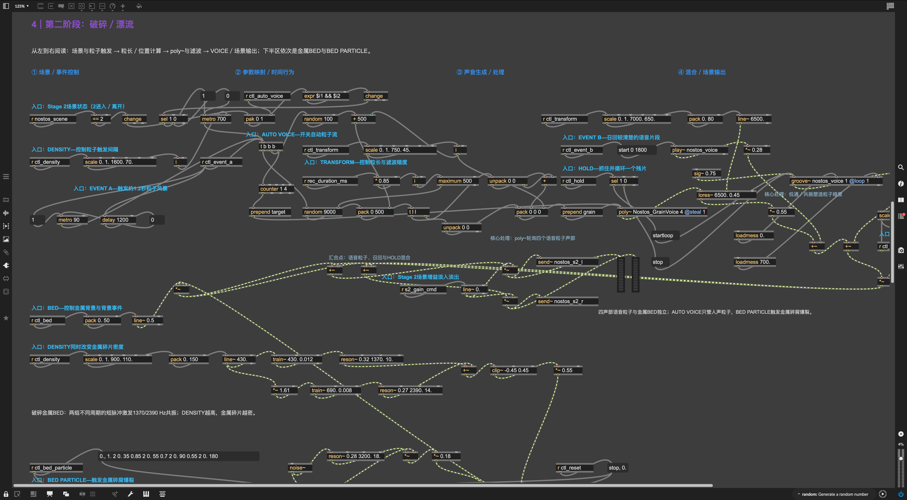
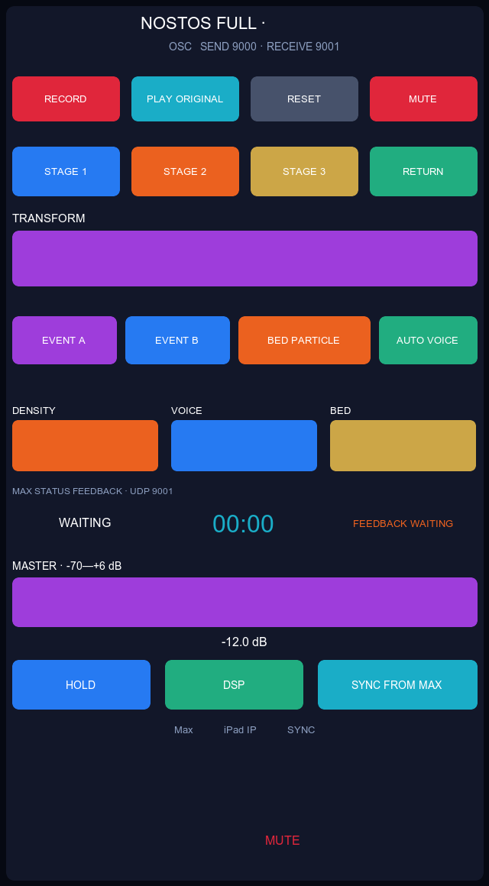

# Nostos: The Return of a Sentence

**《Nostos：一句话的返航》** 是一个使用 Max/MSP 与 TouchOSC 制作的现场实验声音作品。观众朗读的一句话被现场录制，随后经历“出发／战争 → 破碎／漂流 → 重组／归返”，最终以完整原句返回。

> A live experimental sound performance for Max/MSP and TouchOSC. One audience-recorded sentence departs, fragments, drifts, and gradually finds its way home.

[](LICENSE)

## 项目截图

### Max/MSP Patch



Stage 2“破碎／漂流”的工程视图：四声部语音粒子、割裂金属背景、HOLD、召回事件与场景输出。

### TouchOSC 演出界面



单页界面集中提供录音、场景切换、宏观声音推子、事件、总音量与紧急静音，并接收Max返回的场景、参数和演出计时状态。

## 作品结构

| 段落 | 屏幕时间 | 声音行为 |
| --- | ---: | --- |
| 录音与记忆 | 计时前约20—30秒 | 现场录制并完整播放一次原句 |
| Stage 1：出发／战争 | 0:00—0:50 | 完整语言受到减速、重复、密度推进与倒放干预 |
| Stage 2：破碎／漂流 | 0:50—2:05 | 四声部语音粒子、HOLD、金属碎屑与清晰片段召回 |
| Stage 3：重组／归返 | 2:05—3:25 | 风沙、逐渐显现、语音轮廓恢复与前景退让 |
| Return | 3:25—约3:45 | 场景淡出，完整原句返回 |

包括录音前奏和结尾留白后，总时长约4—4分15秒。详细操作见[表演操作谱](NOSTOS_PERFORMANCE_SCRIPT_v01.md)。

## 主要特性

- 只打开一个主Patch完成整场演出。
- 现场录音存入共享`buffer~`，三个Stage读取同一句语音。
- Stage 2使用`poly~`加载四声部受控语音粒子。
- Stage 2的割裂金属BED与Stage 3的风沙BED具有清楚不同的时间行为。
- TRANSFORM、DENSITY、VOICE和BED是少量、明显、可重复的宏观控制。
- EVENT A／B、HOLD和BED PARTICLE提供即时可听的现场事件。
- 所有声音汇入唯一的MASTER、限幅与MUTE安全输出链。
- TouchOSC通过UDP 9000控制Max，Max通过UDP 9001返回状态。
- 不使用第三方Max音频external；MCP开发集成是可选功能。

## 运行要求

- [Max 9](https://cycling74.com/products/max)；当前文件由Max 9.1.5保存。
- 一支麦克风和立体声输出设备。
- 可选：[TouchOSC](https://hexler.net/touchosc)及与电脑处于同一局域网的iPad。
- 可选：[maxmsp-mcp](https://github.com/pawelknorps/maxmsp-mcp)，仅用于AI辅助检查、运行时控制和调试。

本项目目前在macOS上开发和测试。其他Max 9平台理论上可运行，但尚未完成现场验证。

## 快速开始

1. 下载或克隆本仓库。
2. 保持`Nostos_Performance_v01.maxpat`与`Nostos_GrainVoice.maxpat`位于同一目录。
3. 用Max 9打开`Nostos_Performance_v01.maxpat`；不要单独打开粒子声部文件。
4. 点击`RESET`，确认MASTER约为`-12 dB`、MUTE为0。
5. 开启DSP，先以较低扬声器音量测试麦克风输入。
6. 按[表演操作谱](NOSTOS_PERFORMANCE_SCRIPT_v01.md)录制一句话并完成演出。

没有TouchOSC时，可以直接使用Max Presentation Mode中以紫色`控:`标记的控件完成表演。

> [!CAUTION]
> 首次运行请降低物理扬声器音量。若出现过响、尖锐反馈或异常声音，立即按MUTE；不要绕过主输出安全链。

## TouchOSC 设置

1. 在TouchOSC打开`nostos_full.tosc`。
2. 将Connection 1设为UDP并启用。
3. Host填写运行Max的电脑局域网IP。
4. Send Port设为`9000`，Receive Port设为`9001`。
5. 在Max工程视图底部的“iPad IP”文本框输入iPad局域网IP，按Enter或点击“应用IP”。
6. 在TouchOSC点击`SYNC FROM MAX`；状态应由`WAITING`变成`ONLINE`。

场景与计时器通过`/nostos/state/transport <stage> <seconds>`每500 ms组合回传。切换Stage后，TouchOSC上的场景与计时显示通常应在半秒内更新。

## 项目文件

```text
.
├── Nostos_Performance_v01.maxpat        # 主学习／演出Patch
├── Nostos_GrainVoice.maxpat             # Stage 2 poly~粒子声部
├── nostos_full.tosc                      # TouchOSC完整双向界面
├── NOSTOS_PERFORMANCE_SCRIPT_v01.md      # 四分钟表演操作谱
├── NOSTOS_WORKING_DOCUMENT.md            # 设计、技术规范与决策记录
├── docs/
│   └── images/                           # README截图与界面预览
├── experiments/
│   └── Nostos_01_divine_reverse_selector.maxpat
├── tools/                                # TouchOSC／Max构建与静态验证脚本
├── THIRD_PARTY_NOTICES.md
└── LICENSE
```

`Nostos_GrainVoice.maxpat`由主Patch中的`poly~ Nostos_GrainVoice 4 @steal 1`自动加载，不需要单独打开。

## 开发与验证

修改`.maxpat`后建议运行：

```bash
node tools/validate_touchosc_feedback.js
```

验证器检查Max对象的Scripting Name、重复名称、断裂连线，以及TouchOSC布局中的节点ID与场景／计时反馈脚本。项目要求每个Max对象都具有唯一、稳定、语义化的Scripting Name。

若要启用AI代理运行时检查，请按上游说明安装`maxmsp-mcp`。同一个Max实例只保留一个监听UDP 7400的MCP host；普通演出不要求启动MCP客户端。

## 当前状态

这是一个可排练的第一版原型，而不是固定完成版。声音平衡、参数预设和表演节奏仍会根据场地、扬声器与现场录音继续调整。欢迎通过Issue报告可复现的问题。

## AI制作声明

本仓库公开版本中的Max Patch、TouchOSC界面、JavaScript工具脚本、技术实现、测试验证、项目文档、README与发布整理，均由OpenAI Codex根据创作者提出的项目概念、审美方向、试听反馈和表演要求生成并完成。

## 致谢

特别感谢[`pawelknorps/maxmsp-mcp`](https://github.com/pawelknorps/maxmsp-mcp)的作者与贡献者。该项目提供了Max/MSP与AI代理之间的OSC／MCP桥接；Nostos的内嵌MCP主机、运行时检查和调试工作流建立在这一开源项目之上。

本仓库中与该集成有关的第三方版权和许可证信息见[THIRD_PARTY_NOTICES.md](THIRD_PARTY_NOTICES.md)。

## License

Nostos以[MIT License](LICENSE)发布。
